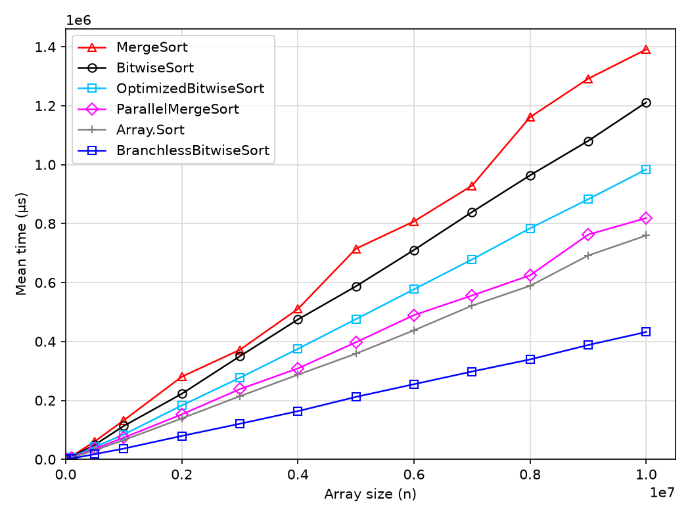

# SortAlgorithms

[](https://github.com/pothinjb/sorting-algorithms/actions/workflows/ci.yml)
[](LICENSE)


A collection of classic and experimental **sorting algorithms in C#**, written to be read side by side with their textbook pseudo-code, together with a shared **unit test suite** and **BenchmarkDotNet** benchmarks to compare them.

This code is the companion of a (French) LaTeX report on algorithms. The implementations deliberately stay close to the CLRS-style pseudo-code (sentinels, inclusive `p..r` / `left..right` bounds, 0-based indices): **readability and faithfulness to the algorithm come first**, raw speed second. Several algorithms also come in "optimized" or parallel variants so you can measure what each trick actually buys you.

> This is an educational / experimental project, not a production sorting library. If you just need to sort, use `Array.Sort`.

## Algorithms

All algorithms sort `int[]`. Most sort **in place**; a few return a new array (noted below).

| Family | Class | Entry points | Notes |
|---|---|---|---|
| Exchange | `BubbleSort`, `ImprovedBubbleSort`, `CocktailSort` | `Sort(A)` | Bubble sort, early-exit bubble sort, bidirectional (shaker) sort |
| Selection | `SelectionSort` | `Sort(A)`, `BasicSort(A)` | `BasicSort` returns a new array |
| Selection | `MinMaxSort` | `Sort(A)`, `OptimizedSort(A)` | Places both the minimum and the maximum on each pass |
| Insertion | `InsertionSort` | `Sort(A)`, `SortRange(A, i, j)` | Plus experimental variants `_Sort1`…`_Sort4` |
| Insertion | `ChunkSort` | `PairSort`, `TripletSort`, `QuartetSort`, `ParallelTripletSort`, `ParallelQuartetSort` | Insertion sort that inserts 2, 3 or 4 elements at a time |
| Insertion | `ShellSort` | `Sort(A)`, `Sort(A, seq)`, `ImprovedSort`, `OptimizedSort` | Gap sequences: Shell, Hibbard, Knuth, Papernov–Stasevich, Sedgewick, Incerpi–Sedgewick, Pratt, Lee (`ShellSequence`, `Gaps`) |
| Insertion | `LibrarySort` | `Sort(A, epsilon)` | Gapped insertion sort; the integer `epsilon` (≥ 1) controls the amount of free space |
| Divide & conquer | `MergeSort` | `Sort(A)`, `ParallelSort(A)` | CLRS merge sort with sentinels |
| Divide & conquer | `MergeInsertionSort`, `MergeQuartetSort`, `OptimizedMergeSort`, `SkipMergeSort` | `Sort(A, …)`, `ParallelSort(A, …)` | Hybrid merge sorts (insertion/quartet sort below a threshold, skipped merges on already ordered runs, parallel recursion) |
| Divide & conquer | `QuickSort` | `new QuickSort().Sort(A, QuickSortMethod.X)` | Hoare, Lomuto and a "naive" partition scheme; partitions are also exposed as static methods |
| Heap | `HeapSort` | `Sort(A)`, `SortUsingNaiveMaxHeapify(A)` | `MaxHeapify` that shifts a "hole" down vs. the naive swap-based version |
| Non-comparison | `CountingSort` | `Sort(A, k)` | Returns a new array; values must be in `[0, k)` |
| Non-comparison | `BitwiseSort`, `OptimizedBitwiseSort` | `Sort(A)` | Binary LSD radix sort; values must be non-negative |

Helpers such as `IndexOf.Min` / `IndexOf.MinMax*` (min/max search, including a tournament method) live in `SortAlgorithms.Core/Services`.

Every public type and method carries XML documentation (complexity, stability, preconditions), so IntelliSense is the quickest way to explore the API.

## Getting started

### Prerequisites

- The [.NET 10 SDK](https://dotnet.microsoft.com/download/dotnet/10.0) or later.

### Editor

Everything works from the command line with the `dotnet` CLI. In an IDE:

| Editor | .NET 10 support |
|---|---|
| [Visual Studio Code](https://code.visualstudio.com/) + [C# Dev Kit](https://marketplace.visualstudio.com/items?itemName=ms-dotnettools.csdevkit) | ✅ Open the folder; projects appear in *Solution Explorer* and the tests in the *Testing* view |
| [Visual Studio 2026](https://visualstudio.microsoft.com/) (18.0+) | ✅ Open `SortAlgorithms.sln` |
| Visual Studio 2022 | ❌ Cannot target `net10.0` — use VS Code, VS 2026 or the CLI |
| JetBrains Rider | ✅ With a release that supports .NET 10 |

### Build and test

```bash
git clone https://github.com/pothinjb/sorting-algorithms.git
cd sorting-algorithms

dotnet build SortAlgorithms.sln
dotnet test SortAlgorithms.Tests
```

Run a single test class:

```bash
dotnet test SortAlgorithms.Tests --filter "FullyQualifiedName~QuickSortTests"
```

### Usage

The APIs are not fully uniform: some algorithms are static classes, others are instances configured by a variant enum or by thresholds.

```csharp
using SortAlgorithms.Core;

int[] a = { 5, 2, 9, 1, 7 };

MergeSort.Sort(a);                                   // static, in place
new QuickSort().Sort(a, QuickSortMethod.Lomuto);     // instance + partition scheme
ShellSort.Sort(a, ShellSequence.Knuth);              // choose a gap sequence
new MergeInsertionSort().ParallelSort(a);            // hybrid, parallel
int[] sorted = CountingSort.Sort(a, k: 10);          // returns a new array, values in [0, 10)
```

## Benchmarks

Benchmarks use [BenchmarkDotNet](https://benchmarkdotnet.org/) and **must be run in Release, from the repository root** (BenchmarkDotNet looks for the project file from the current directory):

```bash
dotnet run -c Release --project SortAlgorithms.Benchmarks
```

The program is interactive. It asks for:

1. the benchmark class to run (one per algorithm family);
2. an array size (leave empty for the defaults 10, 100, 1 000, 10 000, 100 000);
3. the input case: `0` AVERAGE (random data, fixed seed), `1` BEST (ascending), `2` WORST (descending), `3` all three.

These choices are passed to BenchmarkDotNet through the `BENCH_SIZE` and `BENCH_CASE` environment variables. To skip the prompts (in a script, for instance), pipe the three answers:

```bash
# benchmark #12 (QuickSortBenchmark), size 1000, AVERAGE case
printf '12\n1000\n0\n' | dotnet run -c Release --project SortAlgorithms.Benchmarks
```

Every method of a benchmark class sorts a copy of the same input, so the results are directly comparable; one method (usually `MergeSort`) is the baseline of the `Ratio` column. Results (including memory allocations and a rank column) are written to `BenchmarkDotNet.Artifacts/`.

> Each benchmark runs several sizes and can take a while, especially the quadratic sorts on large arrays. Start with a single size.

Any command-line argument skips the prompts and is passed to BenchmarkDotNet, so the standard options are available (`--filter`, `--job short`, `--exporters json`…). The size and case still come from `BENCH_SIZE` / `BENCH_CASE`:

```bash
BENCH_CASE=0 dotnet run -c Release --project SortAlgorithms.Benchmarks -- --job short --filter '*QuickSortBenchmark*'
```

### Example: binary radix sort vs. comparison sorts



| Algorithm | n = 1 M | n = 5 M | n = 10 M | vs `MergeSort` (10 M) | vs `Array.Sort` (10 M) |
|---|---:|---:|---:|---:|---:|
| `MergeSort.Sort` | 132.4 ms | 714.7 ms | 1,391.0 ms | 1.00 | 1.83 |
| `BitwiseSort.Sort` | 113.2 ms | 587.3 ms | 1,211.3 ms | 0.87 | 1.59 |
| `OptimizedBitwiseSort._Sort1` (*OptimizedBitwiseSort*) | 84.1 ms | 475.6 ms | 984.0 ms | 0.71 | 1.30 |
| `MergeSort.ParallelSort` | 73.7 ms | 397.3 ms | 818.8 ms | 0.59 | 1.08 |
| `Array.Sort` | 65.3 ms | 358.6 ms | 759.7 ms | 0.55 | 1.00 |
| `OptimizedBitwiseSort.Sort` (*BranchlessBitwiseSort*) | 36.5 ms | 211.9 ms | 432.2 ms | 0.31 | 0.57 |

The input here is random non-negative integers in `[0, n)`. Merge sort runs in Θ(n log n), while the binary LSD radix sorts grow linearly in Θ(k·n), where k is the number of bits of the largest value (24 for n = 10 M). Taken as is, the textbook `BitwiseSort` is only about 13 % faster than merge sort: it makes many passes, each of which is cheap but full of unpredictable branches. `OptimizedBitwiseSort._Sort1` processes only the bits up to the most significant bit present and swaps the arrays instead of copying group 0 back, which saves about 20 %. The decisive step is the final version, `OptimizedBitwiseSort.Sort`, which adds `Array.Copy` for the concatenation and above all makes the inner loop **branchless**: each value is written to both groups and only the right counter advances, which removes the unpredictable branch on the tested bit. It is 2.3× faster than `_Sort1`, 2.8× faster than `BitwiseSort` and 3.2× faster than merge sort. On a single thread, it beats both `MergeSort.ParallelSort` (1.9×), which uses all 4 cores but only gains 1.7× over the sequential merge sort, and the runtime's `Array.Sort` (introsort, 1.76× at 10 M). The gap already shows at n = 1,000 (14.6 µs vs 16.7 µs). The price is generality and memory: the bitwise sorts only accept non-negative integers and need two auxiliary arrays of size n, i.e. 114 MB allocated per call at n = 10 M. `Array.Sort` allocates only the 38 MB of the benchmark's input copy. The CLRS merge sort, which allocates its sentinel sub-arrays at every merge, allocates 1.5 GB per call, and this garbage-collector pressure probably explains the irregular steps of the two merge-sort curves. Those steps are reproducible from one run to the next: the standard deviation is only about 1 % at 10 M.

*Measured with BenchmarkDotNet 0.15.8, 3 launches × (5 warm-up + 15 measured iterations), .NET 10.0.5, AMD Ryzen 3 3200G (4 cores), Windows 10. In the figure, as in the companion report, `BranchlessBitwiseSort` is `OptimizedBitwiseSort.Sort` and `OptimizedBitwiseSort` is `OptimizedBitwiseSort._Sort1`. To reproduce (about 1 hour), run the command below, then `python scripts/plot_bitwise_benchmark.py` (requires matplotlib):*

```bash
BENCH_CASE=0 dotnet run -c Release --project SortAlgorithms.Benchmarks -- \
  --launchCount 3 --warmupCount 5 --iterationCount 15 --exporters json \
  --filter '*BitwiseSortBenchmark.MergeSort' '*BitwiseSortBenchmark.BitwiseSort' \
           '*BitwiseSortBenchmark.OptimizedBitwiseSort' '*BitwiseSortBenchmark.OptimizedBitwiseSort1' \
           '*BitwiseSortBenchmark.ParallelMergeSort' '*BitwiseSortBenchmark.ArraySort'
```

## Project structure

```
SortAlgorithms.sln
├── .github/workflows/ci.yml      # build + tests on GitHub Actions
├── SortAlgorithms.Core/          # the algorithms, one file per algorithm
│   └── Services/                 # shared helpers (Swap, min/max search)
├── SortAlgorithms.Tests/         # MSTest suite shared by all algorithms
└── SortAlgorithms.Benchmarks/    # BenchmarkDotNet benchmarks + interactive launcher
```

## Known limitations

These are documented in the code as well.

- **Value ranges** — `CountingSort` needs values in `[0, k)` and the bitwise sorts need non-negative values (these preconditions are not checked).
- **QuickSort worst case** — the pivot is always the first or last element, as in the textbook versions, so sorted or reversed input takes Θ(n²) time. The recursion only goes into the smaller partition, so the stack depth stays O(log n).
- **`LibrarySort`** requires `epsilon >= 1` and throws `ArgumentOutOfRangeException` otherwise.
- **Instance-based sorts** (`QuickSort`, `MergeInsertionSort`, `MergeQuartetSort`, `OptimizedMergeSort`) keep their settings in fields: don't share one instance between threads.

## Contributing

Issues and pull requests are welcome — new algorithms, new variants, bug fixes or better benchmarks.

### Adding an algorithm

1. **Core** — add a file in `SortAlgorithms.Core/` that sorts an `int[]`. Keep the code close to the pseudo-code it comes from and document it with XML comments (summary, complexity, preconditions).
2. **Tests** — create an `XxxSortTests` class deriving from `GenericSortTests`:
   - list the variant names in `SortMethods`;
   - map each name to a call in `ApplySort`;
   - copy the `SortMethodData` property and the `[TestMethod]` method that calls `RunAllCommonTests` from an existing test class (for example `QuickSortTests`), replacing the class name.

   The class automatically runs the common suite: empty array, 1–3 elements, random arrays, duplicates, ascending, descending, all-equal. For algorithms limited by value range, pass a `maxRange` to `RunAllCommonTests`.
3. **Benchmarks** — create an `XxxBenchmark` deriving from `BenchmarkSort`:
   - in each `[Benchmark]` method, `Clone()` the input `_A` before sorting;
   - mark one method `Baseline = true` (usually `MergeSort`);
   - add the new class to the `benchmarkTypes` array in `Program.cs`.

### Conventions

- Comments, documentation, test messages and console output are in English.
- Use the textbook naming (`A`, `p`, `q`, `r`, `left`, `right`…) when it helps compare the code with the pseudo-code.
- Run `dotnet test` before opening a pull request. The CI workflow (`.github/workflows/ci.yml`) builds the solution and runs the tests on every push to `main` and on every pull request.

## References

- T. H. Cormen, C. E. Leiserson, R. L. Rivest, C. Stein, *Introduction to Algorithms* (CLRS), MIT Press — the pseudo-code most implementations follow.
- D. E. Knuth, *The Art of Computer Programming, Vol. 3: Sorting and Searching*, Addison-Wesley.
- M. A. Bender, M. Farach-Colton, M. A. Mosteiro, "Insertion Sort is O(n log n)", *Theory of Computing Systems*, 2006 — library sort.
- [Shellsort gap sequences](https://en.wikipedia.org/wiki/Shellsort#Gap_sequences) — overview of the sequences implemented in `ShellSort`.

## License

Released under the [MIT License](LICENSE).
